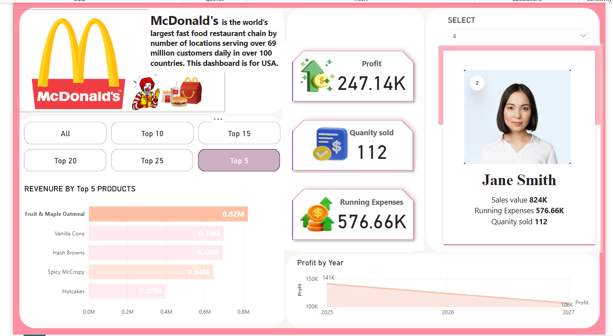

# McDonald's Food Order Analysis - Power BI Dashboard

This repository contains a Power BI dashboard that analyzes McDonald's food orders. The dashboard provides insights into order trends, popular items, and customer preferences using various visualizations such as clustered bar charts, line charts, slicers, and text boxes.

## Dashboard Overview

The Power BI dashboard includes the following components:

1. **Clustered Bar Chart**: Displays the distribution of food items ordered across different categories (e.g., Burgers, Fries, Beverages).
2. **Line Chart**: Shows the trend of orders over time (e.g., daily, weekly, or monthly).
3. **Slicers**: Allow users to filter data by specific criteria such as date range, food category, or location.
4. **Text Boxes**: Provide additional context, such as key insights, assumptions, or data sources.

## Features

- **Interactive Visualizations**: Use slicers to filter and explore data dynamically.
- **Trend Analysis**: The line chart helps identify patterns and trends in order data over time.
- **Category Breakdown**: The clustered bar chart provides a clear view of the most popular food categories.
- **User-Friendly Interface**: The dashboard is designed to be intuitive and easy to navigate.

## How to Use

1. **Download the Power BI File**: Clone this repository and open the `.pbix` file in Power BI Desktop.
2. **Explore the Data**: Use the slicers to filter the data by date, category, or location.
3. **Analyze Trends**: Observe the line chart for order trends over time.
4. **Compare Categories**: Use the clustered bar chart to compare the popularity of different food categories.
5. **Read Insights**: Refer to the text boxes for additional context and insights.

## Screenshots

 
*Example screenshot of the Power BI dashboard.*

## Data Sources

The data used in this project is sourced from Kaggle website . The dataset includes information such as order date, food category, item name, quantity.

## Tools Used

- **Power BI**: For creating the interactive dashboard.
- **GitHub**: For version control and sharing the project.

## Contributing

If you'd like to contribute to this project, feel free to fork the repository and submit a pull request. Please ensure your contributions align with the project's goals.

## License

This project is licensed under the MIT License. See the [LICENSE](LICENSE) file for details.

---

For any questions or feedback, please open an issue or contact [vamsikrishna81068@gmail.com].
